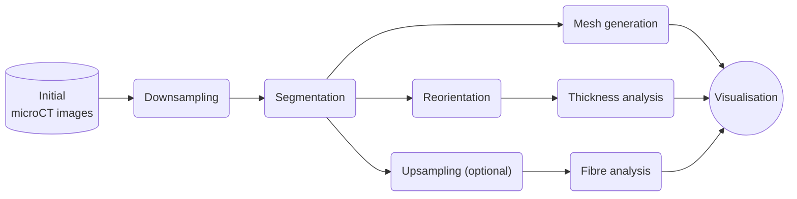

# Uterine $`\mu`$CT analysis
This repository contains code to analyse $`\mu`$CT datasets of rat uteri and used for the paper
__3D virtual histology of the rat uterus musculature using micro-computed tomography__
# Table of contents
1. [Requirements](#requirements)
2. [Workflow](#workflow)
3. [Data folder structure](#structure)
4. [Usage](#usage)
   1. [Setup](#setup)
   2. [Resampling](#resampling)
   3. [Segmentation](#segmentation)
	   1. [MATLAB segmentation](#matlab-segmentation)
	   2. [UNet segmentation](#unet-segmentation)
	   3. [Format conversion](#format-conversion)
   4. [Analysis](#analysis)
       1. [Thickness analysis](#thickness)
       2. [Fibre analysis](#fibre)
       3. [Mesh generation](#mesh)
    5. [Visualisation](#visualisation)
5. [Testing](#testing)
6. [Data availability](#data-availability)


<a id="requirements"></a>
## Requirements
The code was run on Linux Ubuntu 22.04.2 LTS\
The code was developed in [MATLAB](https://www.mathworks.com/products/matlab.html) version 2022a and [Python](https://www.python.org/) version 3.10.6\
The visualisation was done in [cmgui](https://www.cmiss.org/cmgui/)\
The MATLAB code requires the **Image Processing Toolbox** package.\
The required packages for Python are found in requirements.txt\
This project uses [TOML](https://toml.io/en/) files for configuration.

<a id="workflow"></a>
## Workflow 
The following diagram presents the workflow of the project:


<a id="structure"></a>
## Data folder structure 
The folders that contain the data are structured in the following way:
```bash
data
├── AWA015_PTA_1_Rec_Trans
|   ├── AWA015_PTA_1_Rec_Trans.toml
│   └── downsampled
│       ├── AWA015_PTA_1_Rec_Trans_downsampled.toml
│       ├── muscle_segmentation
│       │   ├── left
│       │   └── right
│       └── ST
│           ├── binary
│           ├── extrapolated
│           ├── mask
│           └── masked
├── muscle_segmentation
└── ST
    ├── binary
    ├── extrapolated
    ├── mask
    └── masked
```
Configuration files should have the same name as the dataset and be placed in the data folders.\
There is one configuration file for the main dataset (AWA015_PTA_1_Rec_Trans.toml) and one for the 
downsampled dataset (AWA015_PTA_1_Rec_Trans_downsampled.toml). Example of the configuration files used in this project are placed in the config folder.

<a id="usage"></a>
## Usage 
The main scripts used in this project are contained in the m_scripts folder for the MATLAB code and in the p_scripts for the Python code.

<a id="setup"></a>
### Setup
Install the Python packages and add the location of the code to your PYTHONPATH by running the setup
script:
```bash
./setup
```

In MATLAB, add the code folder and subfolders to the MATLAB search path.

The subfolders of the data folder are not automatically generated; thus, they have to be created beforehand
following the structure presented in the previous section.

The MATLAB and Python scripts use a base directory which is the path to the microCT folder from $HOME.
The default path is Documents/phd. The base directory can be changed for the MATLAB scripts by editing 
the __baseDir.m__ function and for the Python scripts by editing the BASE variable in the __utils.py__ file. Both of these files are located in the utils folder. 

<a id="resampling"></a>
### Resampling 
The image of the original $`\mu`$CT dataset can be downsampled using the __downsampleMicroCTDataset.m__ script 
located in the m_scripts folder. The numbers of the first and last images to be downsampled are specified
in the configuration file. The downsampled images will be saved in the downsampled folder.

The images can either be downsampled by a given factor (less than 1), or the new resolutions for each axis can be 
provided as a 3D vector [x y z]. To upsample the images use a factor greater than 1. 

Similarly, the segmentation masks can be upsampled with the __upsampleMicroCTDatasetSegmentation.m__ script located
in the m_scripts folder. The masks are loaded from one of the segmentation folders and saved in the top-level 
muscle_segmentation folder.

<a id="segmentation"></a>
### Segmentation
<a id="matlab-segmentation"></a>
#### MATLAB segmentation 
The image of the downsampled or original dataset can be segmented with the __segmentMicroCTDataset.m__
script located in the m_scripts folder. There are four types of segmentation possible: fat, tissue,
shape, and muscle. The segmentation masks are saved in different folders depending on the chosen type.
For example, the muscle segmentation masks will be saved in the muscle_segmentation folder, and the
tissue segmentation masks will be saved in the tissue_segmentation folder. The parameters for the segmentation script are set in the configuration file.
<a id="unet-segmentation"></a>
#### UNet segmentation
The images can be segmented using a UNet deep neural network as well. Information about the model as well as the containers and training weights are freely available [here](https://auckland.figshare.com/account/projects/167804/articles/26499451).
The model uses the code from GitHub user Karol Żak. The code is available under the MIT license and can be found [here](https://github.com/karolzak/keras-unet/tree/master).

**NOTE:** The scripts for running inference and training are placed in the unet-segmentation folder.

##### Training
The training images should be placed in a specific folder with an imgs folder containing the $`mu`$CT images an a masks folder containing the training masks. The images should be 512 x 512 pixels.

The **resizeImages.py** script is used to resize images to be 512 x 512 pixels by splitting images into blocks of 512 x 512 pixels. If they are smaller than the required dimensions, they are simply padded with 0s. The script creates a folder called imgs, if it does not already exist, to save the resized images in. To see the arguments and options of the script, use the --help flag:
```bash
python3 resizeImages.py --help
```

The **unetTraining.py** script trains the network using the images in the training folder. The images and masks are read from the imgs and masks folder inside the training folder. The model is saved as unet-model_vX.h5 and the weights are saved as unet-weights_vX.keras, where X is replaced with the value for the version argument of the script.
To see the arguments and options of the script, use the --help flag:
```bash
python3 unetTraining.py --help
```

##### Segmenting
The **unetSegment.py** script segments a dataset using a trained model. The images should be 512 x 512 pixels and placed in the imgs folder of the dataset directory. The segmentation masks are saved in the masks folder of that directory. If that folder does not exist, the script will create it.
To see the arguments and options of the script, use the --help flag:
```bash
python3 unetSegment.py --help
```

The segmentation masks will be 512 x 512 images. The **stitchImages.py** script is used to stitch the image blocks back into their original dimensions. The script will read the images placed in the masks folder and can therefore be used immediately after the **unetSegment.py** script. The stitched images are saved in the stitched folder of that directory. If that folder does not exist, the script will create it.
To see the arguments and options of the script, use the --help flag:
```bash
python3 stitchImages.py --help
```
<a id="format-conversion"></a>
#### Format conversion
The segmentation masks and $`\mu`$CT images can be converted to a 
[NIfTI](https://nifti.nimh.nih.gov/nifti-2/) archive with the __nifti-converter.py__ script located in the
 p_scripts folder. To see the arguments and options of the script, use the --help flag:
```bash
python3 nifti-converter.py --help
```
The NIfTI archive can be read by software such as [ITK-SNAP](http://www.itksnap.org/pmwiki/pmwiki.php) to
 edit the segmentation masks. The edited masks can be exported with the __readNiftiSegmentation.m__
script located in the utils folder. This script requires that the $`\mu`$CT images and the segmentations be located in the same folder.

<a id="analysis"></a>
### Analysis 
The analysis requires muscle segmentation masks.

<a id="thickness"></a>
#### Thickness analysis 
If the $`\mu`$CT images do not slice the uterine horns perpendicularly, the segmentation masks can be reoriented
to align each horn with the z-axis. The __uCTRotation.m__ script located in the m_scripts folder rotates
the left and right horns. The rotated images of each horn are saved in their respective folders. The number
of the first and last images to be rotated can be chosen in the configuration file in case some slices are
already aligned with the z-axis. The **uCTCentreline.m** must be run on the segmentation masks before trying to rotate them.

For example, if the muscle layers have been segmented for a dataset and saved in the muscle_segmentation folder, use the **uCTCentreline.m** script with region "both" to compute the centreline of the segmentation masks. 

Before calculating the muscle wall thickness, the centreline of each horn must be computed with the
__uCTCenterline.m__ script located in the m_scripts folder. The region argument determines which 
segmentation masks are loaded. If "left", "right", or ["left", "right"] are specified, the rotated masks
located in either the left or right folder are used. If "both" is specified, the non-rotated segmentation
masks are used. The centreline of the non-rotated segmentation masks is required for the calculation of the horn length.

Once the centrelines are generated, the analysis can be performed with the 
__uCT-analysis.py__ script located in the p_scripts folder. To see the arguments and options of the 
script, use the --help flag:
```bash
python3 uCT-analysis.py --help
```
The average thickness, the average radius, and the length of each horn will be displayed on the terminal. The plot of the thickness 
variations and the plots of the angular thickness of the __4__ slices selected in the configuration file
will be displayed. The angular and average thicknesses will be saved in the muscle_segmentation folder.

If only a small number of slices are used, with histology for example, the analysis can be performed with the 
__slice-analysis.py__ script located in the p_scripts folder. To see the arguments and options of the 
script, use the --help flag:
```bash
python3 slice-analysis.py --help
```
Only the plots of the angular thickness of the __4__ slices selected in the configuration file
will be displayed. The angular thicknesses will be saved in the muscle_segmentation folder.
<a id="fibre"></a>
#### Fibre analysis
The muscle fibres can be extracted from the muscle segmentation masks. The __STPipeline.m__ script
located in the m_scripts folder finds the fibres using structure tensors. This script requires that the
segmentation masks and the masked uCT images be placed in the ST/mask and ST/masked folders, respectively.
The masks can be applied either by specifying the paths to the masks in the __loadImageStack.m__ function
 located in the utils folder or with the __readNiftiSegmentation.m__ function. They can then be saved
with the __saveImageStack.m__ function located in the utils folder.

The fibres will be annotated based on the angle relative to the centreline of each horn found in the 
centreline.mat file created with the __uCTCentreline.m__ script. If no centreline is provided, the slices
are assumed to be aligned with the z-axis and the fibres are annotated based on the angle relative to the
vector [0 0 1].

The __STPipeline.m__ script will generate .exnode and .exelem files that can be visualised in cmgui. The
parameters for the script can be set in the configuration file.

This code was written by Mark Trew.

<a id="mesh"></a>
#### Mesh generation 
The segmentation masks can be used to generate a surface mesh with software such as 
[ITK-SNAP](http://www.itksnap.org/pmwiki/pmwiki.php). The __mesh-annotation.py__ script annotated a mesh
(surface or volumetric) with the thickness data calculated previously. To see the arguments and options 
of the script, use the --help flag:
```bash
python3 mesh-annotation.py --help
```
The supported file types for the mesh are .vtk, and .vtu.

The __mesh-converter.py__ script converts a mesh (surface or volumetric) to .exnode and .exelem files to
be visualised in cmgui. The mesh can be annotated with the thickness information. 
To see the arguments and options of the script, use the --help flag:
```bash
python3 mesh-converter.py --help
```
The supported file types for the mesh are .vtk, and .vtu.

<a id="visualisation"></a>
### Visualisation 
To visualise the meshes and fibres in cmgui, com files are located in the com folder.\
Below is an example of a figure generated for the article using the 
AWA015_PTA_1_Rec_Trans_L4_fibres.com (A) and the AWA015_PTA_2_Ova_Rec_Trans_L5_fibres.com (B) com files,
which shows the fibres found in the uterus and in a smaller section
of the uterus located near the ovaries.

 and the AWA015_PTA_2_Ova_Rec_Trans_L5_fibres.com (B) com files")

Below is an example of a figure generated for the article using the 
AWA015_PTA_1_Rec_Trans_thickness_mesh.com (A) files which show the thickness of the muscle layers in the uterus and the mesh after a longitudinal cut (B).

 and the AWA015_PTA_1_Rec_Trans_thickness_mesh.com clipped view (B) 
com files.")

<a id="testing"></a>
## Testing
Some scripts have been written to test certain functions of the workflow and are located in the code/tests folder.

The data used for the tests is found in the data/tests folder. An example of the structure is presented below:
```bash
data
└── tests
    └── AWA015
        └── muscle_segmentation
            ├── left_horn_test_mask.png
            ├── right_horn_test_mask.png
            └── centreline.mat
```

The tests are piloted by the test.toml configuration file, which can be found in the config folder. The fields in the test.toml are as follows:
 - sets, which is a list of the names of the folder contained in the data/tests folder on which the tests should be run.
 - horn, which is the horn to process for the first and second image respectfully. For example, if horn is ["left", "right"], the left side of the first image and the right side of the second image will be processed.
 - nb_points, the number of projection points to use when the test requires this value. 
 
 To add new datasets to test, create a similar structure as shown above and edit the sets field of the configuration file. As of now, only two images per dataset are processed.

<a id="data-availability"></a>
## Data availability
The $`\mu`$CT dataset used, the meshes generated, and the UNet model weights are available [here](https://auckland.figshare.com/projects/Three-dimensional_virtual_histology_of_the_rat_uterus_musculature_using_micro-computed_tomography/167804).
